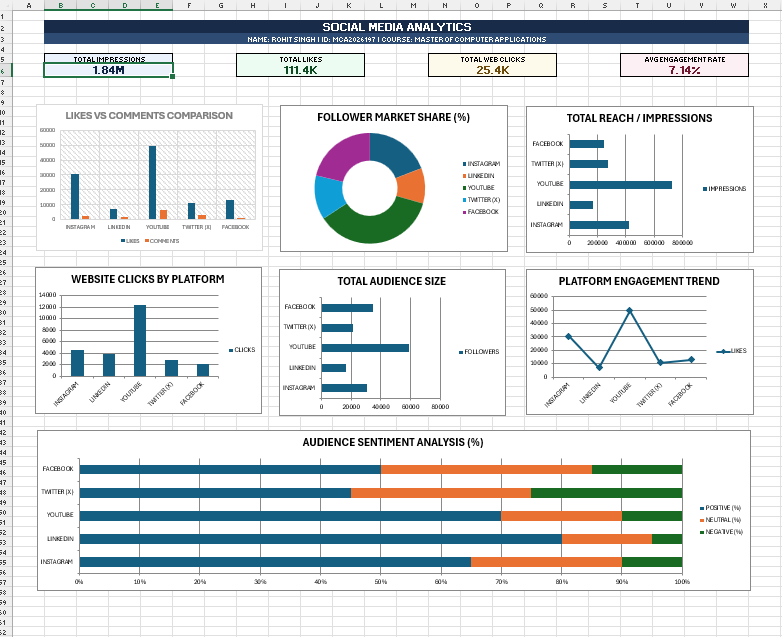

# Social Media Analytics Dashboard

**Course:** Master of Computer Applications (MCA)  
**Project:** Data Analytics Lab Project  
**Student Name:** Rohit Singh  
**Roll No / ID:** MCA2026197  

---

## Project Overview
This project presents a multi-platform performance dashboard created in Microsoft Excel. The objective is to analyze and compare audience engagement, impressions, website traffic, and sentiment across five major platforms:
- Instagram
- LinkedIn
- YouTube
- Twitter (X)
- Facebook

---

## Dashboard Screenshots

### 1. Overview

---

## Key Dashboard Components

### 1. Summary KPI Cards
- **Total Impressions:** 1.84M gross reach
- **Total Likes:** 111.4K overall likes
- **Total Web Clicks:** 25.4K external outbound clicks
- **Average Engagement Rate:** 7.14%

### 2. Analytical Charts
1. **Likes vs Comments Comparison:** Evaluates active user engagement depth.
2. **Follower Market Share (%):** Donut chart representing audience distribution.
3. **Total Reach / Impressions:** Horizontal bar chart comparing platform visibility.
4. **Website Clicks by Platform:** Measures conversion and external website visits.
5. **Total Audience Size:** Compares overall follower bases.
6. **Platform Engagement Trend:** Tracks interactive patterns across networks.
7. **Audience Sentiment Analysis (%):** 100% Stacked Bar chart tracking Positive, Neutral, and Negative user reactions per platform.

---

## Key Findings
- **YouTube** drove the highest volume of impressions (725K) and website click-throughs (12.3K).
- **LinkedIn** demonstrated the highest positive sentiment (80%) due to its professional community.
- **Twitter (X)** had the highest discussion and critique rate, showing 25% negative sentiment.
- **Instagram** maintained a stable engagement rate across regular post interactions.

---

## Tools Used
- **Microsoft Excel:** Data organization, metric aggregation, chart formatting, and dashboard layout.
- **Data Source:** Structured multi-platform social media metrics dataset.

---
*Submitted by Rohit Singh (MCA2026197)*
